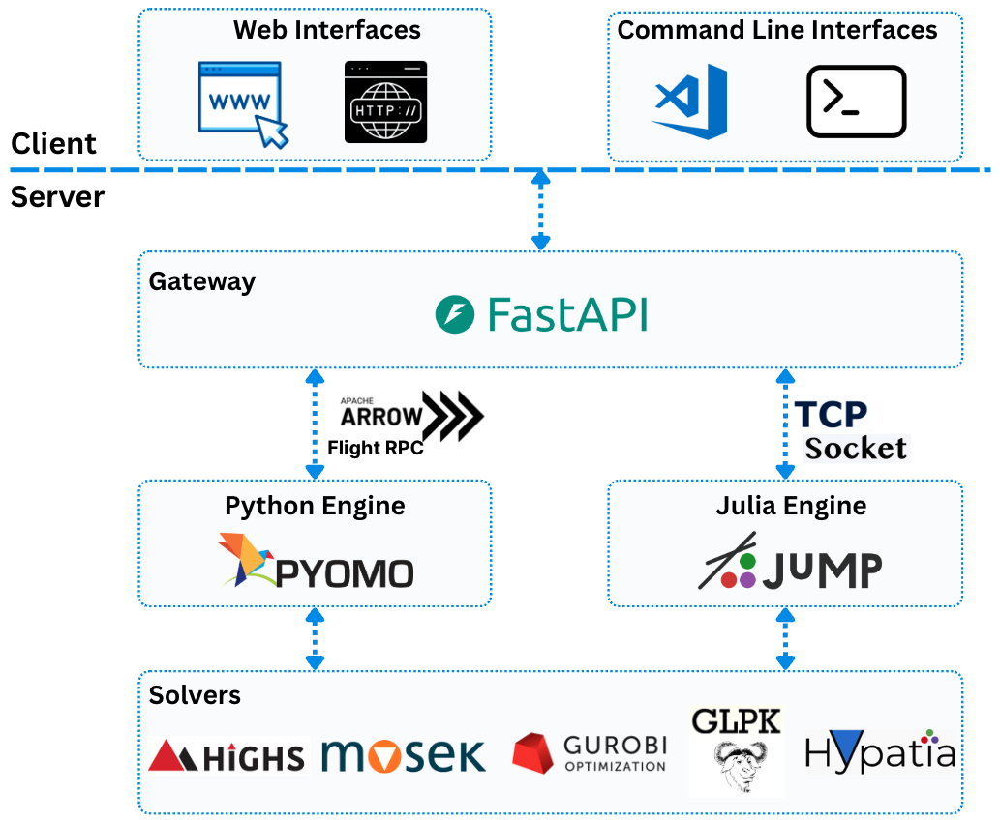

Architecture Overview
=====================

OptArrow's architecture is designed to enable seamless communication between
solver backends while exposing a stable client-facing interface.
Its runtime is composed of three core services, and clients such as Python or
MATLAB interact with the system through the gateway.

Key Components
--------------

1. **Gateway**: The entry point for all optimization requests. It receives requests, manages sessions, and routes tasks to the appropriate solver backend. It also provides a unified interface that abstracts language-specific differences between Python and Julia, allowing users to switch solvers with minimal code changes.

2. **Python Engine**: The Python optimization engine, built on libraries such as Pyomo. It uses Apache Arrow Flight RPC for efficient communication with the Gateway and is designed to execute optimization workloads such as Linear Programming (LP) and Quadratic Programming (QP).

3. **Julia Engine**: The Julia optimization engine, built on libraries such as JuMP. It leverages Julia's performance advantages for computationally intensive optimization problems. It communicates with the Gateway through socket-based TCP connections, using Apache Arrow IPC bytes for efficient data exchange.

Client Interfaces
-----------------

OptArrow can be called from multiple client environments as long as they can
construct a valid request payload and send it to the gateway.

- **Python clients** can call the gateway directly or build Arrow payloads in
  process.
- **MATLAB clients** can use the packaged MATLAB interface under
  ``src/matlab/+optarrow`` to send Arrow IPC requests through the gateway.

This keeps OptArrow generic: client-specific model translation lives in the
client project, while OptArrow itself remains focused on transport, model
contracts, and backend execution.

These services can run independently, enabling flexible deployment and
scaling. The Gateway serves as the central hub, coordinating requests and
responses between clients and backend engines.
